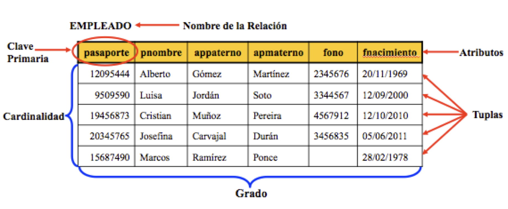

# Algebra Relacional

## Introducción

¿Qué es el algebra relacional?:

- Algebra cuyos operandos son relaciones o variables que representan relaciones.
- Lenguaje de consulta procedimental.
- Consta de un conjunto de operaciones que toman una o dos relaciones de entrada y generan una nueva relacion como resultado.
- Operaciones fundamentales:
  - Selección
  - Proyección
  - Unión
  - Diferencia de conjuntos
  - Producto Cartesiano
  - Renombramiento
- Existen otras operaciones definidas en términos de las fundamentales.

Kernel del algebra relacional:

- Seleccion: recorriendo ciertas filas
- Proyeccion: recorriendo determinadas columnas.
- Productos y uniones: composiciones de relaciones
- Renombrado de relaciones
- Union interseccion y diferencia
  - Operaciones de conjunto pero que ambos operandos deben tener el **mismo esquema**
- Operadores de comparación (=, <>, <, >, <=, >=)
- Operadores lógicos (y(^), o(˅) y no(˺))

### Modelo relacional

Es un modelo basado en el concepto matemático de relación que proviene de la teoría de conjuntos.
Una relación matemática puede representarse como una tabla, integrando una estructura de atributos y tuplas.
Partes:

- Atributo: nombre que encabeza la columna
- Grado: numero de atributos
- Dominio: conjunto de valores permitidos para un atributo
- Tupla: fila de una tabla
- Cardinalidad: numero de tuplas que contiene una relacion

## Operaciones Unarias

### Tabla de ejemplo

| ID    | Nombre           | nombre_dpto | Edad |
| ----- | ---------------- | ----------- | ---- |
| 20101 | Lazaro Hernandez | Informatica | 51   |
| 20102 | Juan Tortajada   | Informatica | 30   |
| 20103 | Jorge Crespo     | Matematicas | 25   |
| 20104 | Juan Luis Vidal  | Fisica      | 34   |
| 20105 | Manuel Masias    | Informatica | 40   |
| 20106 | Alba Hernandez   | Psicologia  | 30   |

### Seleccion

- Procedimiento de seleccion de tuplas que satisfacen un predicado
- Notacion: σ (sigma minuscula)

La seleccion **σ nombre_dpto=Fisica(profesores)** devolveria la relacion:
| | | | |
|-|-|-|-|
| 20104 | Juan Luis Vidal | Fisica | 34 |

La seleccion **σ edad>50(profesores)** devolveria la relacion:

|       |                  |             |     |
| ----- | ---------------- | ----------- | --- |
| 20101 | Lazaro Hernandez | Informatica | 51  |

Se pueden utilizar los operadore logicos para seleccionar varios atributos:

La seleccion **σ nombre_dpto=informatica ^ edad<50(profesores)** devolveria la relacion:
| | | | |
| ----- | ---------------- | ----------- | --- |
| 20102 | Juan Tortajada | Informatica | 30 |
| 20105 | Manuel Masias | Informatica | 40 |

### Proyeccion

- Devuelve su relacion de atributos excluyendo algunos de ellos, **se eliminan todas las filas duplicadas**
- Notacion: Π (pi mayuscula)

La proyeccion **Π id, nombre, edad(profesores)** devolveria:

| ID    | Nombre           | Edad |
| ----- | ---------------- | ---- |
| 20101 | Lazaro Hernandez | 51   |
| 20102 | Juan Tortajada   | 30   |
| 20103 | Jorge Crespo     | 25   |
| 20104 | Juan Luis Vidal  | 34   |
| 20105 | Manuel Masias    | 40   |
| 20106 | Alba Hernandez   | 30   |

Se pueden combinar, por ejemplo, **Π nombre(σ nombre_dpto=Fisica(profesores))**, devolveria:
| |
| --------------- |
| Juan Luis Vidal |

## Operaciones unarias sobre el mismo esquema

### Producto cartesiano

- Permite combinar informacion de dos relaciones cualesquiera
- Notacion: X (rXs)

Tabla A:
| |
| - |
| a |
| b |

Tabla B:

|     |
| --- |
| x   |
| y   |

**AxB**:
| | |
| - | - |
| a | x |
| a | y |
| b | x |
| b | y |

### Interseccion

- A interseccion B es el conjunto de todas las tuplas que pertenecen a A y a B
- Notacion: AᴖB

Tabla A:

| ID  | Nombre      | Salario |
| --- | ----------- | ------- |
| 1   | Juan Pérez  | 5000    |
| 2   | María López | 6000    |
| 3   | Luis García | 7000    |

Tabla B:

| ID  | Nombre      | Salario |
| --- | ----------- | ------- |
| 2   | María López | 6000    |
| 3   | Luis García | 7000    |
| 4   | Ana Gómez   | 5500    |

Tabla **AᴖB**:

| ID  | Nombre      | Salario |
| --- | ----------- | ------- |
| 2   | María López | 6000    |
| 3   | Luis García | 7000    |

### Union

- A union B es el conjunto de los elementos comunes y la exclusion de los repetidos.
- Notacion: AUB

Tabla A:
| ID | Nombre | Salario |
|------|--------------|---------|
| 1 | Juan Pérez | 5000 |
| 2 | María López | 6000 |
| 3 | Luis García | 7000 |

Tabla B:

| ID  | Nombre      | Salario |
| --- | ----------- | ------- |
| 3   | Luis García | 7000    |
| 4   | Ana Gómez   | 5500    |
| 5   | Pablo Díaz  | 6200    |

Tabla **AUB**:

| ID  | Nombre      | Salario |
| --- | ----------- | ------- |
| 1   | Juan Pérez  | 5000    |
| 2   | María López | 6000    |
| 3   | Luis García | 7000    |
| 4   | Ana Gómez   | 5500    |
| 5   | Pablo Díaz  | 6200    |

### Diferencia de conjuntos

- Permite encontrar las tuplas que estan en una relacion, pero no en la otra.
- Notacion: A-B

Si una consulta A devuelve:
| |
|---------|
|INF-301|
|INF-101|

Y una consulta B:
| |
|---------|
|INF-456|
|INF-101|

El resultado **A-B** seria:
| |
|---------|
|INF-301|

### Renombramiento

- Renombra los resultados de las expresiones del algebra relacional
- NOtacion: p x (A), devolveria el resultado de A con atributos x.

Tabla A:

| ID  | Nombre      | Salario |
| --- | ----------- | ------- |
| 1   | Juan Pérez  | 5000    |
| 2   | María López | 6000    |
| 3   | Luis García | 7000    |

Tabla **p IdEmpleado,NombreEmpleado,SalarioEmpleado(A)**:

| IdEmpleado | NombreEmpleado | SalarioEmpleado |
| ---------- | -------------- | --------------- |
| 1          | Juan Pérez     | 5000            |
| 2          | María López    | 6000            |
| 3          | Luis García    | 7000            |

## Relaciones binarias

### Reunion natural

- Genera pares de filas de las 2 relaciones de entrada que tienen los mismos valores en todos los atributos con el mismo nombre
- Notacion: A⋈B
- Como funciona:
  - Primero forma un producto cartesiano
  - A continuacion realiza una seleccion forzando la igualdad de los atributos
  - Por ultimo elimina duplicados

Tabla A:

| ID  | Nombre      | Departamento |
| --- | ----------- | ------------ |
| 1   | Juan Pérez  | Ventas       |
| 2   | María López | Finanzas     |
| 3   | Luis García | Marketing    |

Tabla B:

| ID  | Proyecto   | Departamento |
| --- | ---------- | ------------ |
| 1   | Proyecto A | Ventas       |
| 2   | Proyecto B | Marketing    |
| 4   | Proyecto C | IT           |

Tabla **A⋈B**:

| ID  | Nombre      | Departamento | Proyecto   |
| --- | ----------- | ------------ | ---------- |
| 1   | Juan Pérez  | Ventas       | Proyecto A |
| 3   | Luis García | Marketing    | Proyecto B |

### Reunion Externa

- Es una extension de la operacion reunion para trabajar con informacion ausente
- Hay 3 tipos:
  - Reunion externa por la izquierda: ⟕
  - Reunion externa por la derecha: ⟖

Tabla A:
| ID | Nombre | Departamento |
|------|--------------|--------------|
| 1 | Juan Pérez | Ventas |
| 2 | María López | Finanzas |
| 3 | Luis García | Marketing |

Tabla B:

| ID  | Proyecto   | Departamento |
| --- | ---------- | ------------ |
| 1   | Proyecto A | Ventas       |
| 2   | Proyecto B | Marketing    |
| 4   | Proyecto C | IT           |

Tabla **A⟕B**:
| ID | Nombre | Departamento | ID | Proyecto | Departamento |
|------|--------------|--------------|------|--------------|--------------|
| 1 | Juan Pérez | Ventas | 1 | Proyecto A | Ventas |
| 2 | María López | Finanzas | NULL | NULL | NULL |
| 3 | Luis García | Marketing | 2 | Proyecto B | Marketing |

Tabla **A⟖B**:
| ID | Nombre | Departamento | ID | Proyecto | Departamento |
|------|--------------|--------------|------|--------------|--------------|
| 1 | Juan Pérez | Ventas | 1 | Proyecto A | Ventas |
| 3 | Luis García | Marketing | 2 | Proyecto B | Marketing |
| NULL | NULL | NULL | 4 | Proyecto C | IT |

### Agregacion

- Operacion que toma un conjunto de valore y devuelve uno unico como resultado
- Notacion: G(caligrafica)

Tabla A:

| ID  | Nombre      | Salario |
| --- | ----------- | ------- |
| 1   | Juan Pérez  | 5000    |
| 2   | María López | 6000    |
| 3   | Luis García | 7000    |

Resultado **G_sum(salario) (profesores)**: 5000 + 6000 + 7000 = **18000**

### Division

- Define una relacion sobre los atributos que consiste en que el conjunto de tupoas desde R coincida con el conjunto de tuplas en S
- Notacion: ÷

Tabla Habilidades:

| ID_Empleado | Habilidad |
| ----------- | --------- |
| 1           | Java      |
| 1           | Python    |
| 1           | SQL       |
| 2           | Java      |
| 2           | Python    |
| 3           | Java      |
| 3           | SQL       |
| 4           | Java      |
| 4           | Python    |
| 4           | SQL       |

Tablas Habilidades_Requeridas:
| Habilidad |
|-----------|
| Java |
| Python |
| SQL |

Resultado **Habilidades÷Habilidades_Requeridas**:
| ID_Empleado |
| ----------- |
| 1 |
| 4 |

Devuelve este resultado ya que el 1 y el 4 son los unicos empleados que tienen como habilidades las 3 requeridas
