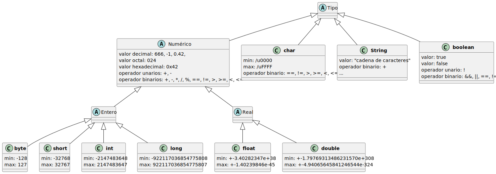

# Variables

## ¿Por qué?

|                                                                                                                                                                                                                |                                                                                          |
| -------------------------------------------------------------------------------------------------------------------------------------------------------------------------------------------------------------- | ---------------------------------------------------------------------------------------- |
| En el proceso de construcción de programas y aplicaciones, es necesario almacenar temporalmente informacion, además de manipular y mantener un registro de ciertos valores durante la ejecución de un programa | Además se necesita mantener, pasar y manupular datos entre diferentes partes del código. |

## ¿Qué?

Las variables son utilizadas para almacenar datos en un programa. Pueden contenr diferentes tipos de información, como números, caracteres, textos, o incluso, estructuras de datos más complejas.

## ¿Para qué?

| CRUD de datos                  | Mejorar Comprensión              | Optimizar recursos                        |
| ------------------------------ | -------------------------------- | ----------------------------------------- |
| Gestiona informacion relevante | Mejora la legibilidad del código | Permite una gestión eficiente de recursos |

## ¿Cómo?

**Declaración de variables**

| Declaración        | Tipo   | Identificador |
| ------------------ | ------ | ------------- |
| `int miOrden;`     | int    | miOrden       |
| `double miCosto;`  | double | miCosto       |
| `String miNombre;` | String | miNombre      |

**Tipos**
|Tipos primitivos|
|--|
|

### Funciones matemáticas

> Math.metodo(parametros);

| Metodo | Descripcion           | Parámetros                                 | Devuelve                 |
| ------ | --------------------- | ------------------------------------------ | ------------------------ |
| abs    | Valor absoluto        | Un valor de tipo int, long, float o double | Tipo de dato introducido |
| sqr    | Raíz cuadrada         | Double                                     | Double                   |
| pow    | Potenciación          | Base y exponente (Double)                  | Double                   |
| random | Aleatorio entre 0 y 1 | Nada                                       | Double                   |

### Constantes

- Para declarar una constante se antepone la palabra **final** a la declaración de la variable.
- Por convención, es escriben en mayúscula y en snake case (palabras separadas por '\_' )

```java
final double GRAVEDAD = 9.8;
final double IVA_GENERAL = 0.21;
final double IVA_REDUCIDO = 0.1;
final double IVA_SUPERREDUCIDO = 0.05;
```

### Operadores relacionales

| Operador | Función              |
| :------: | -------------------- |
|    ==    | igualdad en valor    |
|    !=    | desigualdad en valor |
|    <     | menor                |
|    <=    | menor o igual        |
|    >     | mayor                |
|    >=    | mayor o igual        |

#### Operador ternario

```
<expresión> ? <expresión> : <expresión>
```

Evalua una expresión y de vuleve otra dependiendo de si es verdadero o falso

```java
final int MAYORIA_DE_EDAD = 18;
int edad = 20;
boolean mayorDeEdad = edad > MAYORIA_DE_EDAD ? true : false;
```
