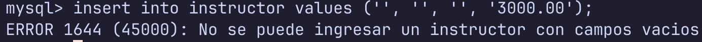

# Lenguajes de Consulta DML IV

#### Base de datos uni_2025

## Subconsultas

- Es una consulta dentro de otra consulta
- En su forma mas simple , la subconsulta aparece dentro de las clausulas WHERE.
- Aportan una forma eficiente para gestionar peticiones expresadas en terminos de otras consultas.

Select \* from student where id not in (select id from takes);
| ID | name | dept_name | tot_cred |
|-------|------|-----------|----------|
| 70557 | Snow | Physics | 56 |

Este es el unico estudiantes que esta en student pero no en takes.

## Test de pertenencia

- Compara un valor de la fila que se esta probando con un conjunto de valores producidos por la subconsulta.
- Indica si los datos estan o no en la tabla

Ej: liste los instructores que se encuentran en departamentes cuyos presupuestos estan por encima de 90000
SELECT \* FROM instructor WHERE dept_name IN (SELECT dept_name from department where budget > 90000)
| ID | name | dept_name | salary |
|-------|------------|-|-|
| 10101 | Srinivasan | Comp. Sci. | 65000.00 |
| 12121 | Wu | Finance | 90000.00 |
| 45565 | Katz | Comp. Sci. | 75000.00 |
| 76543 | Singh | Finance | 80000.00 |
| 83821 | Brandt | Comp. Sci. | 92000.00 |

## Test de existencia

- Verifica la existencia de un valor en un conjunto de otros valores dados mediante una subconsulta
- Se reconocen porque en el enunciado esta la palabra hay o existe

Lista los departamentos en los cuales hay o existe al menos una asignatura que se imparte en otoño en 2017.

SELECT DISTINCT dept_name from instructor i where exists (select t.course_id from teaches t where t.id=i.id and semester='fall' and year = 2017)

| dept_name  |
| ---------- |
| Comp. Sci. |
| Physics    |

## Test Any-All

### All

Selecciona los datos de los instructores cuyo salario multiplicado por 1.5 es mayor que todos los presupuestos de los departamentos.

SELECT instructor.name from instructor where (1.5\*salary)>all(Select budget from department);

| name     |
| -------- |
| Wu       |
| Einstein |
| Gold     |
| Brandt   |

### Any

select instructor.name from instructor where (.60 \* salary) > any (select budget from department);
| name |
| -------- |
| Wu |
| Einstein |
| Gold |
| Brandt |

## Vistas

Crear la vista\
create view instructor_view as select \* from instructor where salary < 65000;

Usarla\
select \* from instructor_view;\

Ej 2:
select salary, count(_) from instructor_view group by salary having count(_)>1 order by salary asc;

Listar todas las vistas\
show full tables where table_type = 'VIEW';

### Insertar datos en vista

CREATE VIEW taylor_building AS SELECT \* FROM section s where s.building='Taylor';

El resultado de esta tabla es:
| course_id | sec_id | semester | year | building | room_number | time_slot_id |
|-----------|--------|----------|------|----------|-------------|--------------|
| CS-190 | 1 | Spring | 2017 | Taylor | 3128 | A |
| CS-190 | 2 | Spring | 2017 | Taylor | 3128 | E |
| CS-319 | 2 | Spring | 2018 | Taylor | 3128 | C |
| CS-347 | 1 | Fall | 2017 | Taylor | 3128 | A |
| EE-181 | 1 | Spring | 2017 | Taylor | 3128 | C |

insert into taylor_building (course_id, sec_id, semester, year, building, room_number, time_slot_id) VALUES ('CS-300',1,'Fall', 2022, 'Taylor', '3','C');
Al volver a seleccionarla, se obtiene:

| course_id | sec_id | semester | year | building | room_number | time_slot_id |
| --------- | ------ | -------- | ---- | -------- | ----------- | ------------ |
| CS-300    | 1      | Fall     | 2022 | Taylor   | 3           | C            |
| CS-190    | 1      | Spring   | 2017 | Taylor   | 3128        | A            |
| CS-190    | 2      | Spring   | 2017 | Taylor   | 3128        | E            |
| CS-319    | 2      | Spring   | 2018 | Taylor   | 3128        | C            |
| CS-347    | 1      | Fall     | 2017 | Taylor   | 3128        | A            |
| EE-181    | 1      | Spring   | 2017 | Taylor   | 3128        | C            |

## Trigger

- Es el equivalente a un script en SQL, sonsite en una serie de procedimientos que se ejecutan segun instrucciones definidas.

DELIMITER //
CREATE TRIGGER salary_control BEFORE INSERT ON instructor FOR EACH ROW
BEGIN
DECLARE msg VARCHAR(255);
IF (NEW.ID=''||NEW.name = '' || NEW.dept_name = '' || NEW.salary) THEN SET msg = 'No se puede ingresar un instructor con campos vacios';
SIGNAL SQLSTATE '45000' SET message_text = msg;
END IF;
END //

Una vez creado, al hacer una insercion en instructor que compla los requisitos del trigger (datos vacios) devuelve el siguiente mensaje;

