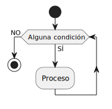
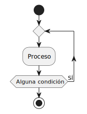

# Estructuras repetitivas

## Iterativa indeterminada 0..N



```java
while (<expresión>)
    <sentencia o bloque de código>
```

## Iterativa indeterminada 1..N



```java
do
    <sentencia o bloque de código>
while (<expresión>)
```

## Iterativa determinada

```java
for([<inicialización>]; [<condición>]; [<incremento>] )
    <sentencia o bloque de código>
```
