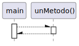
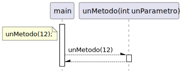
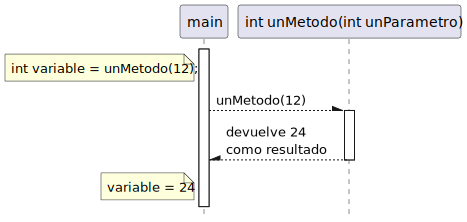

# Métodos estáticos

## ¿Por qué?

Surgen como una solución para evitar repetir código y organizarlo.

## ¿Qué?

Un método estático es una función que puede ser llamada sin la necesidad de crear una instancia de una clase.

## ¿Para qué?

Los métodos estáticos se utilizan para:

- Realizar operaciones generales que no dependen del estado de un objeto.
- Agrupar funciones lógicas que están relacionadas entre sí (por ejemplo, operaciones matemáticas).
- Proporcionar una manera de organizar el código que sea fácil de entender y de reutilizar en diferentes partes del programa.

## ¿Cómo?

### Declaración

```java
class UnaClase {

    // CÓDIGO de la clase UnaClase

    public static void unMetodo() {
        // CODIGO DEL MÉTODO unMetodo()
    }

    // MÁS CÓDIGO de la clase UnaClase

}
```

### Uso

```java
class UnaClase {

    public static void main(String[] args){

        // CÓDIGO DEL MÉTODO main

        unMetodo();

        // MAS CÓDIGO DEL MÉTODO main

    }

    public static void unMetodo() {
        // CÓDIGO DEL MÉTODO unMetodo()
    }

    // MÁS CÓDIGO de la clase UnaClase

}
```

### "Conversación"

|                                                               |                                                               |                                                       |
| ------------------------------------------------------------- | ------------------------------------------------------------- | ----------------------------------------------------- |
|  |  |  |

#### Reparto de Responsabilidades

- **Cohesión**: Deben, deben tener una única responsabilidad o propósito.

- **Organización lógica**: Deben organizarse de tal manera que estén relacionados lógicamente.

- **Independencia**: Deben diseñarse para ser independientes de los estados.

#### Saber Delegar

- **Reutilización**: Son excelentes para ser reutilizados en diferentes partes del programa.

- **Facilitar las pruebas**: Al ser independientes del estado de los objetos, pueden ser más fáciles de probar. No obstante, si se abusa de ellos, puede ser más difícil realizar pruebas unitarias debido a su naturaleza global y a la dificultad de simular su contexto.

- **Acoplamiento**: Abusar de los métodos estáticos puede llevar a un alto grado de acoplamiento entre clases, ya que el código en una clase puede llegar a depender excesivamente de los métodos estáticos de otra clase.

- **Flexibilidad**: A medida que una aplicación crece, usar muchos métodos estáticos puede reducir la flexibilidad del código. En programación orientada a objetos, el uso de instancias de clases permite sobrescribir y extender funcionalidades, algo que no es tan sencillo con métodos estáticos.

- **Escalabilidad**: En aplicaciones grandes y complejas, el uso excesivo de métodos estáticos puede hacer más difícil el escalado y la mantenibilidad del sistema. Por ello, es importante balancear su uso con instancias de clases y técnicas de orientación a objetos.

#### Balance y Moderación

- **No Abusar**: Aunque los métodos estáticos son útiles, es importante no abusar de ellos. Deben usarse cuando tienen sentido semántico y no como una forma de evitar aprender sobre objetos y clases.

- **Transición a objetos**: Incluso en programación estructurada, los métodos estáticos pueden ayudar a entender la organización y la abstracción de funciones en lo que eventualmente serán clases y objetos. Es recomendable usarlos como un puente hacia la programación orientada a objetos, sin perder de vista que el paradigma orientado a objetos ofrece muchas más herramientas para la organización y estructuración del código.
